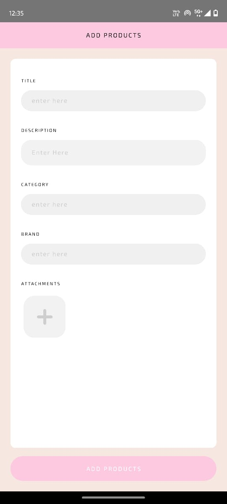
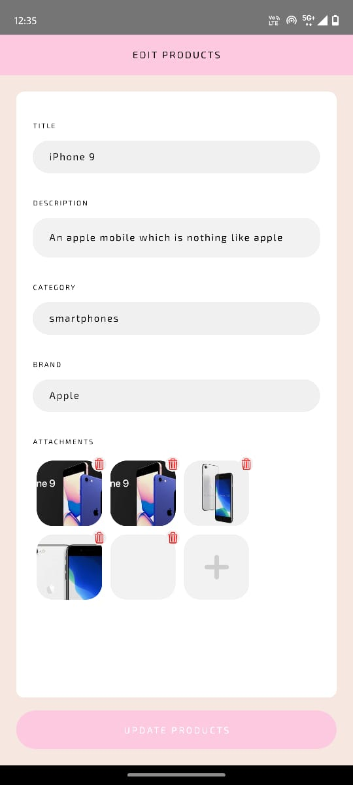
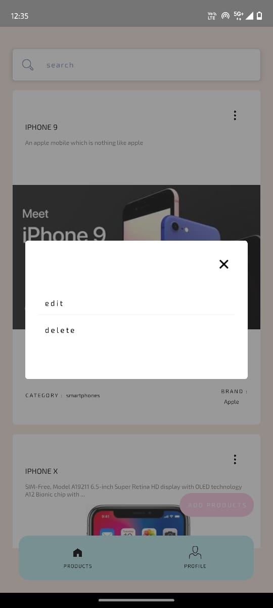
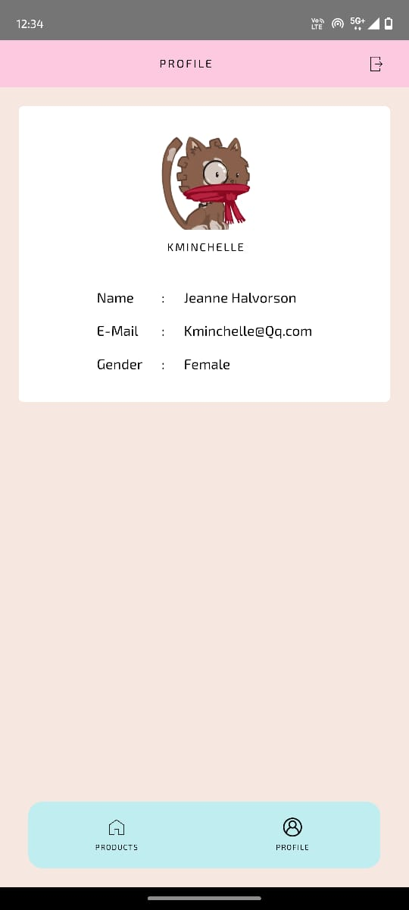
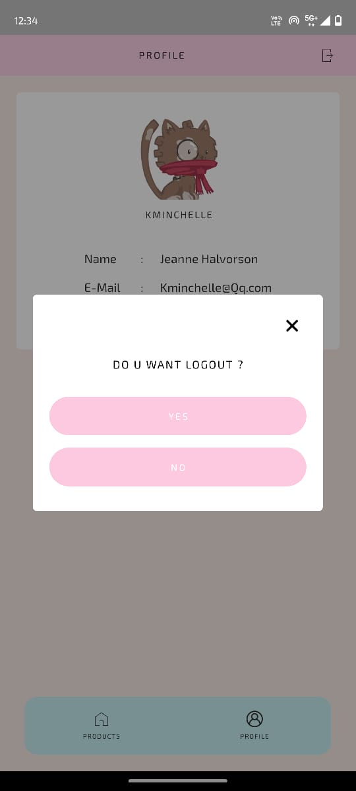
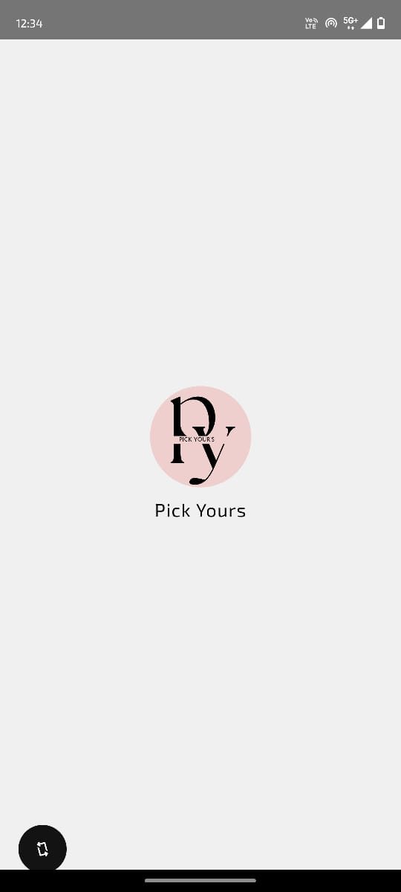

# 🛍️ PickYours

PickYours is a sleek and simple product management app built with **React Native**, allowing users to add, view, edit, and delete products. Ideal for small-scale inventory management, demo e-commerce apps, or as a boilerplate for product-based mobile apps.

---

## ✨ Features

- ➕ Add new products
- 📝 Edit existing products
- ❌ Delete products
- 👤 View and manage profile
- 🔒 Logout functionality
- 🖼️ Modern UI with clean layout

---

## 🧰 Tech Stack


---

### Folder Structure

src/
  ├── Assets/
  │   └── ScreenShots/
  ├── components/
  ├── screens/
  └── navigation/

  ---

## 🖼️ Screenshots

### ➕ Add Product  


### 📝 Edit  


### ❌ Delete  


### 🧑 Profile  


### 🔒 Logout  


### 🧠 Logo  


---

## 📦 Installation & Running Locally

```bash
git clone https://github.com/Hariharan09/PickYours.git
cd PickYours
npm install

# If using Expo
npx expo start

# OR for React Native CLI
npx react-native run-android
